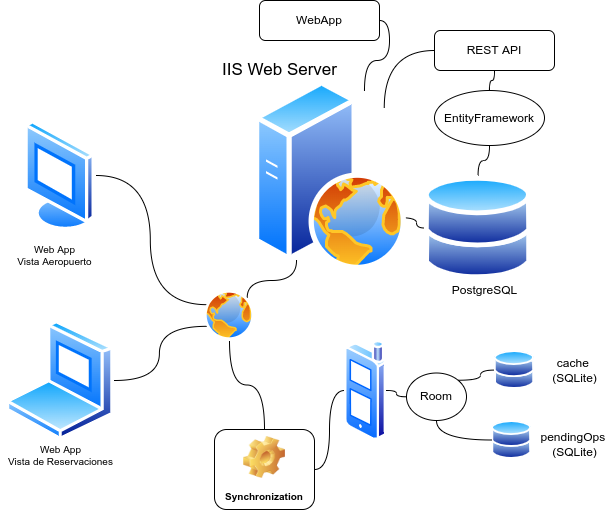

---
title:
  Instituto Tecnológico de Costa Rica\endgraf\bigskip \endgraf\bigskip\bigskip\
  TecAir Proyecto 1: TECAir \endgraf\bigskip\bigskip\bigskip\bigskip
author:
  - José Morales Vargas, carné 2019024270
  - Alejandro Soto Chacón, carné 2019008164
  - Ignacio Vargas Campos, carné 2019053776
  - José Retana Corrales, carné 2020144743
date: \bigskip\bigskip\bigskip\bigskip Área Académica de\endgraf Ingeniería en Computadores \endgraf\bigskip\bigskip\ Bases de Datos \endgraf  (CE3101) \endgraf\bigskip\bigskip Profesor Marco Rivera Meneses \endgraf\vfill  Semestre I 2022
header-includes:
  - \setlength\parindent{24pt}
  - \usepackage{url}
  - \usepackage{float}
  - \floatplacement{figure}{H}
lang: es-ES
papersize: letter
classoption: fleqn
geometry: margin=1in
fontsize: 12pt
fontfamily: sans
linestretch: 1.5
bibliography: bibliografia.bib
csl: ieee.csl
nocite: | 
  @microsoft-2022A, @microsoft-2022B, @microsoft-2020, @google-2021, @google-2022, @elmasri-2016, @unknown-author-2021
...

\maketitle
\thispagestyle{empty}
\clearpage
\tableofcontents
\pagenumbering{roman}
\clearpage
\pagenumbering{arabic}
\setcounter{page}{1}

## Modelo conceptual

## Modelo relacional

### Justificación de mapeo

## Estructuras de datos desarrolladas

### Servidor

### App móvil

En el caso de la aplicación móvil solo era necesario tener una imagen similar a la del servidor de los datos, sin embargo, se podía omitir varias relaciones presentes en la base de datos principal pues no son relevantes para la funcionalidad de la aplicación móvil. 

Afortunadamente, la biblioteca de Room permite definir las relaciones implementadas de forma concisa, por lo que se muestran extractos del código utilizado para representar la estructura de las relaciones implementadas. Nótese que existen relaciones similares a las del servidor, sin embargo, se han reducido datos almacenados y se ha cambiado campos para adaptar el modelo al contexto de la app móvil.

- Relación `User`: representación de un usuario. 

```Kotlin
@Entity(primaryKeys = ["username", "id"])
data class User(
    val type: Int = 0,
    val id: String, //uuid
    val username: String,
    val password: String,
    val firstName: String,
    val lastName: String,
    val phoneNumber: String,
    val email: String,
    val university: String,
    val studentId: String,
)
```

- Relación `UserOp`: representación de una operación pendiente a realizar
  sobre un usuario. La anotación `@Embedded` significa que se concatenan
  todos los datos de una tupla de la relación usuario. Para uso en sesiones
  sin conexión.

```Kotlin
@Entity
data class UserOp(
    @PrimaryKey val uuid: String,
    val operation: String,
    @Embedded
    val user: User
)
```

- Relación `Flight`: Contiene los datos que necesita la aplicación móvil sobre un vuelo.
  Se asume que el vuelo está en estado de booking.

```Kotlin
@Entity(primaryKeys = ["id"])
data class Flight(
    val id: String, //uuid
    val no: Int,
    val comment: String,
    val price: Double
)
```

- Relación `Flight`: Contiene los datos que necesita la aplicación móvil sobre un segmento
  de un vuelo. Se asume que solo son de vuelos en estado de booking.

```Kotlin
@Entity
data class Segment(
    @PrimaryKey val id: String,
    val flight: String,
    val seqNo: Int,
    val fromLoc: String, 
    val fromTime: String,
    val toLoc: String, 
    val toTime: String,
    val aircraft: String,
)
```

- Relación `Booking`: Utilizada para almacenar los datos de una reservación que se encuentra pendiente
  a concretar. Para uso en sesiones sin conexión. 

```Kotlin
@Entity(primaryKeys = ["flight", "pax"])
data class Booking(
    val flight: String, //uuid
    val pax: String, //uuid
    val promo: String //uuid
)
```

- Relación `Promo`: Contiene los datos relevantes para una promoción. Puede contener o no una imagen.

```Kotlin
@Entity
data class Promo(
    @PrimaryKey val id: String,
    val code: String,
    val flight: String,
    val price: Double,
    val startTime: Double,
    val endTime: String,
    @ColumnInfo(typeAffinity = ColumnInfo.BLOB)
    val img: ByteArray?,
)
```

## Descripción detallada de la arquitectura desarrollada

### Diagrama de arquitectura



## Problemas conocidos

## Problemas encontrados

## Conclusiones

## Recomendaciones

## Bibliografía

::: {#refs}
:::

## Diagramas de clases

## Anexos 
