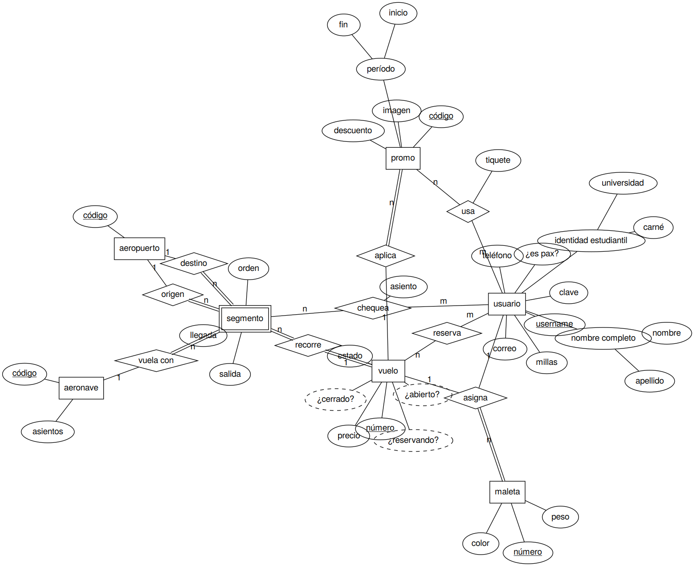
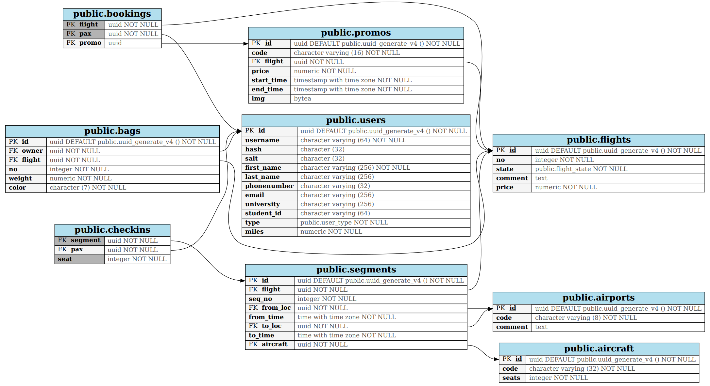
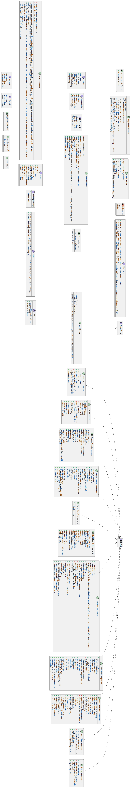

---
title:
  Instituto Tecnológico de Costa Rica\endgraf\bigskip \endgraf\bigskip\bigskip\
  Proyecto 1 - TECAir \endgraf\bigskip\bigskip\bigskip\bigskip
author:
  - José Morales Vargas, carné 2019024270
  - Alejandro Soto Chacón, carné 2019008164
  - Ignacio Vargas Campos, carné 2019053776
  - José Retana Corrales, carné 2020144743
date: \bigskip\bigskip\bigskip\bigskip Área Académica de\endgraf Ingeniería en Computadores \endgraf\bigskip\bigskip\ Bases de Datos \endgraf  (CE3101) \endgraf\bigskip\bigskip Profesor Marco Rivera Meneses \endgraf\vfill  Semestre I 2022
header-includes:
  - \setlength\parindent{24pt}
  - \usepackage{url}
  - \usepackage{float}
  - \floatplacement{figure}{H}
lang: es-ES
papersize: letter
classoption: fleqn
geometry: margin=1in
fontsize: 12pt
fontfamily: sans
linestretch: 1.5
bibliography: bibliografia.bib
csl: ieee.csl
nocite: | 
  @microsoft-2022A, @microsoft-2022B, @microsoft-2020, @google-2021, @google-2022, @elmasri-2016, @unknown-author-2021, @android-room
...

\maketitle
\thispagestyle{empty}
\clearpage
\tableofcontents
\pagenumbering{roman}
\clearpage
\pagenumbering{arabic}
\setcounter{page}{1}

## Modelo conceptual



## Justificación de mapeo conceptual-relacional

### UUID
Para este proyecto se utilizaron en la mayoría de relaciones/entidades UUID o Identificadores Únicos Universales como las llaves de sus erespectivas relaciones, esto se realizó con el objetivo de poder lograr la correcta sincronización entre el app mobil y app web, y para así lograr que el sistema responda bien a cambios incluso si ocurren conflictos entre versiones de la base de datos.

### Mapeo de entidad Vuelo

Esta entidad fuerte se convierte en una relación de tal manera que se mantienen sus atributos simples. Se utiliza un uuid llamada "id" como llave primaria de esta relación

### Mapeo de entidad Usuario

Similarmente a la entidad "vuelo", la entidad "usuario" se convierte en una relación, de manera que se mapeen todos sus atributos en esta relación, separando los atributos compuestos nombres completos y las identidades estudiantiles en sus distintos componentes. Se utiliza un uuid llamada "id" como llave primaria de esta relación

### Mapeo de entidad Aeronave

Para la entidad fuerte "aeronave" se pasa a una relación, incluyendo todos sus atributos simples. Se utiliza un uuid llamada "id" como llave primaria de esta relación

### Mapeo de entidad Aeropuertos

Para la entidad fuerte "aeropuertos" se pasa a una relación, donde se incluyen todos sus atributos simples. Se utiliza un uuid llamada "id" como llave primaria de esta relación.

### Mapeo de entidad Maleta y relación "asigna"

Para la entidad fuerte "maleta" se pasa a una relación, donde se incluyen todos sus atributos simples y se utiliza un uuid llamada "id" como llave primaria de esta relación. Este está relacionado con usuario y con vuelo por medio de la relación "asigna" de tipo N:1, lo cual implica que en maleta (el lado N de la relación) se inncluyen como llaves foráneas el uuid del usuario llamado "dueño" y el uuid del vuelo llamado "flight".

### Mapeo de Promos y relaciónes "usa" y "aplica"

Para la entidad fuerte "promos" se pasa a una relación, donde se incluyen todos sus atributos simples y se utiliza un uuid llamada "id" como llave primaria de esta relación. Este está relacionado con vuelo y con usuario por medio de las relación "usa" de tipo N:M y aplica de tipo N:1. Para su simplificación se simplifica las relaciones en una nueva relación llamada "bookings" donde se tienen tres llaves primarias, todas de tipo uuid, "flight" la id de los vuelos, "pax" siendo la de los usuarios y "promo" siendo la de las promos.

### Mapeo de Segments y relaciónes "chequea", "origen", "detino", "vuela con" y "recorre"

Para la entidad fuerte "segmento" se pasa a una relación, donde se incluyen todos sus atributos simples y se utiliza un uuid llamada "id" como llave primaria de esta relación. Para la relaciónes de segmento, se tiene "recorre" de tipo N:1 con vuelo,para las relaciones "origen" y "destino" de tipo N:1 con aeropuerto, la relación "vuela con" con aeronave de tipo N:1. Para cada una de estas, se incluye una llave foránea en Segments, para así mantener la conexión entre todas estas relaciones.Para la relación con usuario de "chequea", al ser de tipo N:M, se crea una relación adicional llamado "checkins" el cual tiene como llave primaria la uuid "pax" de usuarios y la uuid "segment" para los segmentos, junto con el atributo de la relación "seat".


## Modelo relacional



## Estructuras de datos desarrolladas

### Backend

Muchas de las estructuras se comparten con la app móvil (ver siguiente sección).
Se describen a continuación aquellas que son específicas del backend y/o de la
interacción backend-app web.

```csharp
public class NewUser
{
    [Required]
    public UserType Type { get; set; }
    [Required]
    public string Username { get; set; } = null!;
    [Required]
    public string Password { get; set; } = null!;
    [Required]
    public string FirstName { get; set; } = null!;
    public string? LastName { get; set; }
    public string? PhoneNumber { get; set; }
    public string? Email { get; set; }
    public string? University { get; set; }
    public string? StudentId { get; set; }
}
```

Esta estructura se utiliza para crear nuevos usuarios. Nótese que no contiene
sal ni hash, sino más bien la contraseña en texto plano, así como los datos de
contacto del usuario. El tipo de usuario solamente puede establecerse una vez
aquí.

```csharp
public class EditUser
{
    [Required]
    public string Username { get; set; } = null!;
    [Required]
    public string Password { get; set; } = null!;
    [Required]
    public string FirstName { get; set; } = null!;
    public string? LastName { get; set; }
    public string? PhoneNumber { get; set; }
    public string? Email { get; set; }
    public string? University { get; set; }
    public string? StudentId { get; set; }
}
```

Esta estructura es parecida a la anterior, pero elimina aquellos campos que ya
no se pueden alterar una vez creado un usuario, como su tipo. Se utiliza al
momento de editar usuarios. Los valores nulos se toman como indicios de no
alterar el campo en cuestión, particularmente útil para contraseña ya que la
msima no es recuperable si no se conoce.

```csharp
public class NewBooking
{
    [Required]
    public Guid Pax { get; set; }
    public Guid? Promo { get; set; }
}
```

Estructura utilizada para reservar un vuelo. El identificador de vuelo se
conoce a partir de la query string.

```csharp
public class CheckIn
{
    [Required]
    public Guid Pax { get; set; }
    [Required]
    public int Seat { get; set; }
}
```

Semejante al anterior, se utiliza para hacer check-in. El número de asiento
debe ser no negativo y menor que el máximo del segmento donde se hace chequeo.

```csharp
public class NewBag
{
    [Required]
    public Guid Owner { get; set; }
    [Required]
    public decimal Weight { get; set; }
    [Required]
    public string Color { get; set; } = null!;
}
```

Utilizado para insertar una maleta de un pasajero chequeado.  El color tiene la
forma `#rrggbb` y el peso es no negativo.

```csharp
public class NewFlight
{
    [Required]
    public int No { get; set; }
    [Required]
    public decimal Price { get; set; }
    [Required]
    public string? Comment { get; set; } = null!;
    [Required]
    public NewSegment[] Segments { get; set; } = null!;
    [Required]
    public Guid[] Airports { get; set; } = null!;
}
```

Para la inserción de nuevos vuelos. El número de vuelo es especificado por el
usuario, junto a precio y comentario. Los segmentos deben de ser una lista no
vvacía y los aeropuertos deben tener exactamente un elemento más que la lista
de segmentos.

```csharp
public class NewSegment
{
    [Required]
    public Guid Aircraft { get; set; }
    [Required]
    public DateTimeOffset FromTime { get; set; }
    [Required]
    public DateTimeOffset ToTime { get; set; }
}
```

Estructura que se referencia en `NewFlight` para la creación de segmentos del
vuelo en cuestión, ya que los segmentos son entidades débiles.

```csharp
public class Booked
{
    public decimal Total { get; set; }
}
```

Respuesta exitosa a una reservación, indicando el monto total a cobrar.

```csharp
public class SearchResult
{
    public Flight Flight { get; set; } = null!;
    public Airport[] Route { get; set; } = null!;
    public SegmentSeats[] Segments { get; set; } = null!;
}
```

Resultado de búsqueda o de información sobre vuelo. Incluye un vuelo, su ruta
completa y los segmentos que la conforman.

```csharp
public class TaggedSegment
{
    public Guid Id { get; set; }
    public Guid Flight { get; set; }
    public int SeqNo { get; set; }
    public String FromLoc { get; set; } = null!;
    public DateTimeOffset FromTime { get; set; }
    public String ToLoc { get; set; } = null!;
    public DateTimeOffset ToTime { get; set; }
    public Guid Aircraft { get; set; }
}
```

Campos de un segmento junto a información de utilidad (nombre de aeropuertos en
vez de UUIDs). Usado al volcar segmentos.

```csharp
public class SegmentSeats
{
    public Guid Id { get; set; }
    public DateTimeOffset FromTime { get; set; }
    public DateTimeOffset ToTime { get; set; }
    public string AircraftCode { get; set; } = null!;
    public int Seats { get; set; }
    public int[] Unavail { get; set; } = null!;
}
```

Contenido de un segmento tras enumerar un vuelo, incluye los asientos ya no
disponibles.

```csharp
public class InsertedBag
{
    public Guid Id { get; set; }
    public int No { get; set; }
}
```

Respuesta a una maleta recién agregada.

```csharp
public class PaxClose
{
    public Guid Pax { get; set; }
    public int Bags { get; set; }
}
```

Elemento de respuesta a cierre de vuelo, indica un pasajero y su número de
maletas.

### Estructuras comunes y de app móvil

En el caso de la aplicación móvil solo era necesario tener una imagen similar a la del servidor de los datos, sin embargo, se podía omitir varias relaciones presentes en la base de datos principal pues no son relevantes para la funcionalidad de la aplicación móvil. 

Afortunadamente, la biblioteca de Room permite definir las relaciones implementadas de forma concisa, por lo que se muestran extractos del código utilizado para representar la estructura de las relaciones implementadas. Nótese que existen relaciones similares a las del servidor, sin embargo, se han reducido datos almacenados y se ha cambiado campos para adaptar el modelo al contexto de la app móvil.

- Relación `User`: representación de un usuario. 

```Kotlin
@Entity(primaryKeys = ["username", "id"])
data class User(
    val type: Int = 0,
    val id: String, //uuid
    val username: String,
    val password: String,
    val firstName: String,
    val lastName: String,
    val phoneNumber: String,
    val email: String,
    val university: String,
    val studentId: String,
)
```

- Relación `UserOp`: representación de una operación pendiente a realizar
  sobre un usuario. La anotación `@Embedded` significa que se concatenan
  todos los datos de una tupla de la relación usuario. Para uso en sesiones
  sin conexión.

```Kotlin
@Entity
data class UserOp(
    @PrimaryKey val uuid: String,
    val operation: String,
    @Embedded
    val user: User
)
```

- Relación `Flight`: Contiene los datos que necesita la aplicación móvil sobre un vuelo.
  Se asume que el vuelo está en estado de booking.

```Kotlin
@Entity(primaryKeys = ["id"])
data class Flight(
    val id: String, //uuid
    val no: Int,
    val comment: String,
    val price: Double
)
```

- Relación `Flight`: Contiene los datos que necesita la aplicación móvil sobre un segmento
  de un vuelo. Se asume que solo son de vuelos en estado de booking.

```Kotlin
@Entity
data class Segment(
    @PrimaryKey val id: String,
    val flight: String,
    val seqNo: Int,
    val fromLoc: String, 
    val fromTime: String,
    val toLoc: String, 
    val toTime: String,
    val aircraft: String,
)
```

- Relación `Booking`: Utilizada para almacenar los datos de una reservación que se encuentra pendiente
  a concretar. Para uso en sesiones sin conexión. 

```Kotlin
@Entity(primaryKeys = ["flight", "pax"])
data class Booking(
    val flight: String, //uuid
    val pax: String, //uuid
    val promo: String //uuid
)
```

- Relación `Promo`: Contiene los datos relevantes para una promoción. Puede contener o no una imagen.

```Kotlin
@Entity
data class Promo(
    @PrimaryKey val id: String,
    val code: String,
    val flight: String,
    val price: Double,
    val startTime: Double,
    val endTime: String,
    @ColumnInfo(typeAffinity = ColumnInfo.BLOB)
    val img: ByteArray?,
)
```

## Descripción detallada de la arquitectura desarrollada


### Diagrama de arquitectura


### Aplicación REST API

Para esta unidad de la arquitectura se tienen 3 elementos principales a notar, los cuales se ven denotados en el diagrama de arquitectura:

+ Se despliega la aplicación sobre una máquina virtual con Windows 10 que funciona como servidor de IIS.
+ El computador que funciona como servidor tiene instalado PostgreSQL como base de datos
+ En la capa del servicio en sí, se tiene una aplicación de C# que interactúa con la base de datos del computador utilizando
  el EntityFramework

El servicio web se ve expuesto en el puerto 5000 del servidor. 

### Aplicación Web

Para la unidad de aplicación web, similar a la REST API la misma es desplegada sobre un servidor de IIS, sin embargo, funcionalmente esto no significa que la app web "reside" en el servidor, sino que funciona como una fuente para enviar los recursos necesarios para construír la página a un usuario. 

Un usuario puede interactuar con dos vistas distintas: Vista de Reservaciones y Vista de Aeropuertos. Algunas partes de la funcionalidad es compartida, sin embargo existen funcionalidades en que son únicas a la Vista de Aeropuertos, esto porque esta "Sub Aplicación" de la aplicación principal tiene como usuario a los trabajadores de la aerolínea, mientras que la vista de reservaciones tiene como usuarios a los clientes. 
Esta estructura se puede notar en el diagrama de arquitectura, en donde se muestra que los recursos de la app web viven en el mismo servidor de IIS que la REST API, pero las vistas de operación se utilizan desde computadores individuales por aparte.

### Aplicación Móvil

En en caso de la app móvil se puede notar lo siguiente:

- Se hace uso de SQLite para guardar datos persistentes en el dispositivo móvil.
- La interfaz entre la aplicación y SQLite se da por medio de la biblioteca Room.
- El dispositivo móvil se conecta a la red, pero antes de conectarse a la red existe un nodo que indica la existencia de un proceso de sincronización durante las interacciones con los recursos de la red.

La arquitectura anterior es producto de los requerimientos de la aplicación móvil, en específico, que a diferencia de la aplicación web, la aplicación móvil debe proveer la funcionalidad de la vista de reservaciones incluso sin conexión a los recursos de red. Es por esto que la misma dispone de sus propias bases de datos locales. El tamaño de los símbolos de base de datos también denota algo adicional - respecto a la base de datos principal, la base de datos local de la aplicación móvil contiene significativamente menor información, puesto que mucha de la información guardada en el servidor principal es irrelevante para la operación de la aplicación móvil.

## Problemas conocidos

- No es un problema per se, sino que es una anotación sobre una funcionalidad de la aplicación móvil (que además se consideraba extra). Se estipula la posibilidad de que una promoción tenga una imagen asociada. Está la lógica para extraer los datos, almacenarlos localmente, e incluso está el espacio apartado para presentar dicha imagen, sin embargo, debido a restricciones de tiempo no se completó la rutina para interpretar los datos de la imagen y cargarlos en la vista de lista de promociones de la app móvil. 

## Problemas encontrados

### Configuración de variables de ambiente en IIS: 

Para permitir que la REST API se pudiese desplegar en varios sistemas distintos se decidió hacer del connection string un dato provisto en la máquina del cliente. Inicialmente se creyó que las aplicaciones desplegadas en IIS tomarían valores de variables de ambiente del sistema que contiene el IIS, sin embargo esto resultó ser equivoco. 

- Resolución: Se siguieron los pasos indicados por [@unknown-author-2015] para la configuración de variables de ambiente en IIS.

### Solicitudes a HTTP con "clear text"

El problema encontrado consistía en que la aplicación móvil no podía realizar solicitudes al servidor, puesto que se hacía por medio de HTTP, no HTTPS.

- Resolución: Modificar el Android manifest para permitir este tipo de solicitudes de forma explícita:

```xml
    <application
        android:name=".TECAirApp"
        android:allowBackup="true"
        android:icon="@mipmap/ic_launcher"
        android:label="@string/app_name"
        android:roundIcon="@mipmap/ic_launcher_round"
        android:supportsRtl="true"
        android:theme="@style/Theme.TECAir"
        android:usesCleartextTraffic="true">
```

## Conclusiones

- Se aplicaron los conocimiento adquiridos en el curso sobre modelos conceptuales y relacionales de bases de datos.

- Se desarrolló exitosamente un servicio REST API en C# usando el Entity Framework.

- Se hizo uso de SQLite como base de datos empotrada para una aplicación móvil.

- Se utilizaron exitosamente tecnologías para el desarrollo de aplicaciones web tales como HTML5, CSS, Boostrap y Angular. Las aplicaciones exponen correctamente las funcionalidades solicitadas a los usuarios. 

- Para servicios REST minimalistas, el flujo de trabajo con ASP.NET Core y las herramientas de OpenApi/Swagger facilitan una implementación rápida y eficiente, sin pérdida en desempeño o en mantenibilidad.

- De querer tener un servicio web corriendo en una máquina de Windows y que el mismo sea accesible desde computadoras exteriores, IIS es una herramienta que se puede utilizr para lograr este objetivo.

- Se cumplió con la solicitud de documentación para usuario final, es decir, se confeccionaron tanto manuales de instalación como manuales de operación para los usuarios finales.

## Recomendaciones

- Utilizar room como interfaz para manipular bases de datos en SQLite, puesto que permite chequear que las queries sean correctas a tiempo de compilación, ventaja que no se tiene al usar las APIs base. 

- Usar el EntityFramework para interacción con bases de datos en C# 

- Usar Npgsql para la programación de 

- Si se desea usar Windows como sistema operativo de servidor, se recomeinda utilizar las herramientas de IIS. 

- Se recomiendo el uso de herramientas de control de versiones pues facilitan fuertemente la colaboración en grupo.

## Bibliografía

::: {#refs}
:::

## Diagramas de clases

### REST API


### App móvil


### App web


