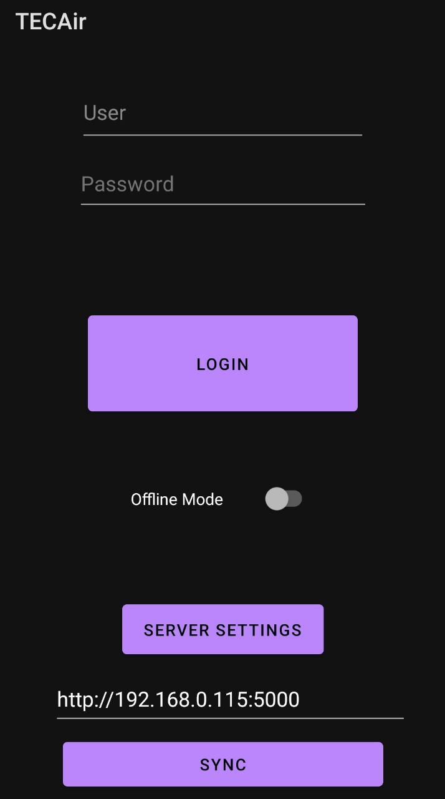
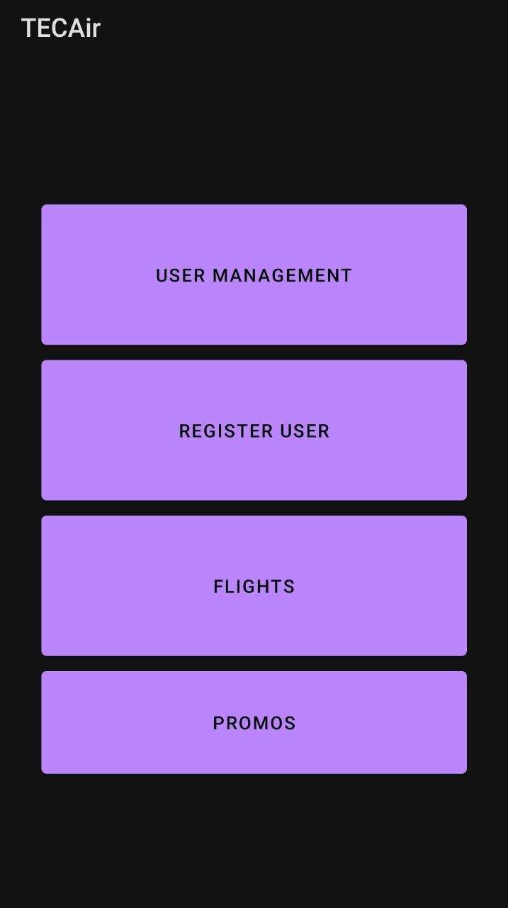
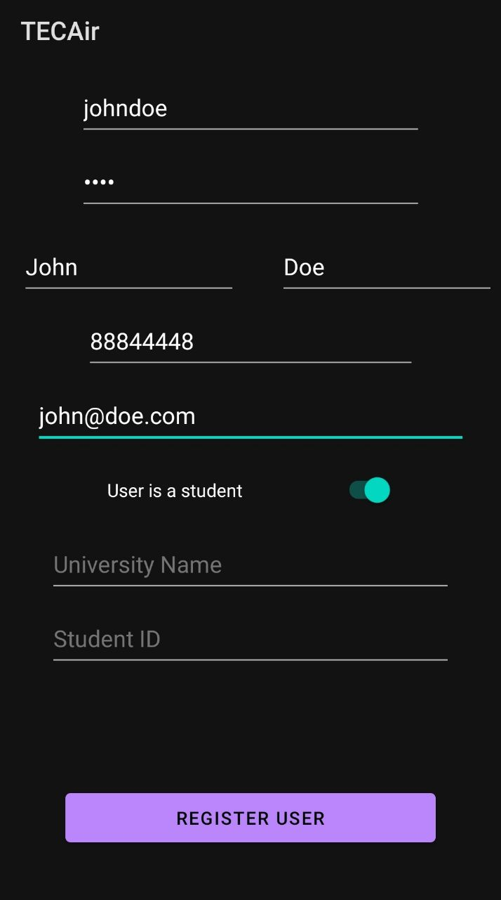
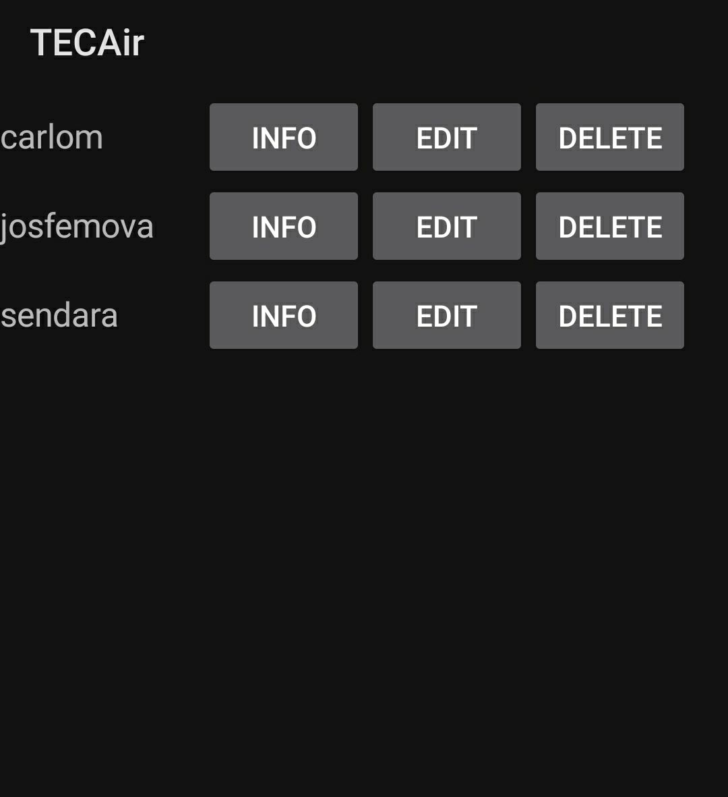
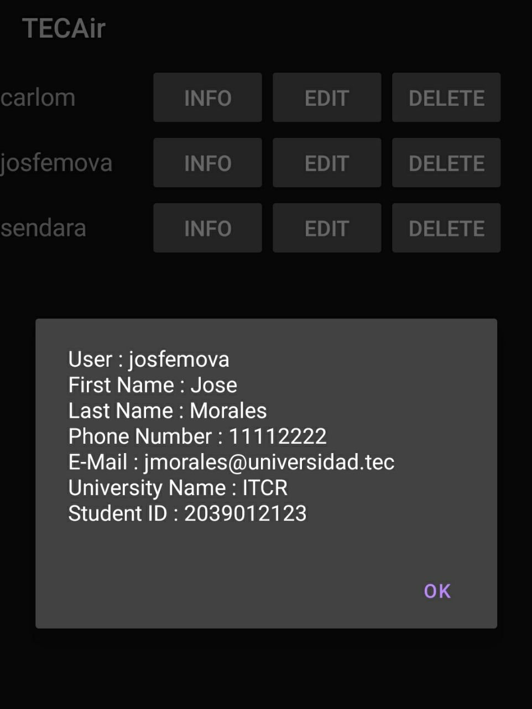
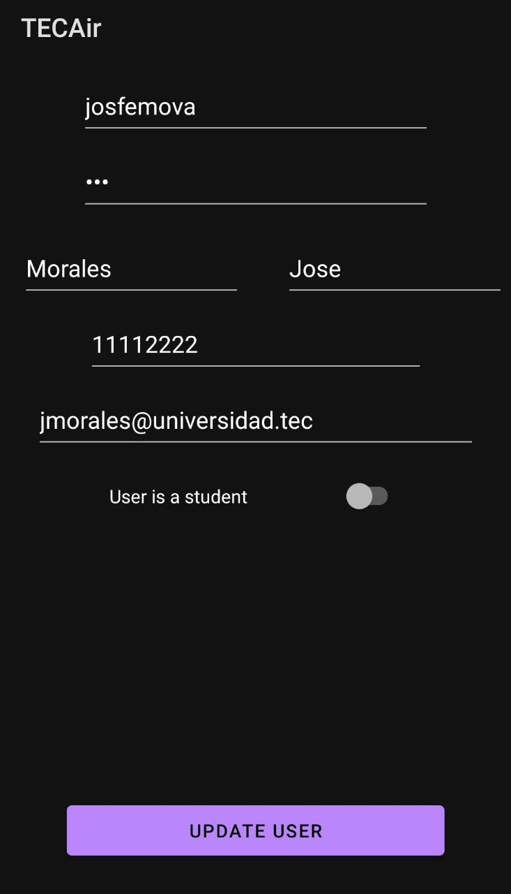
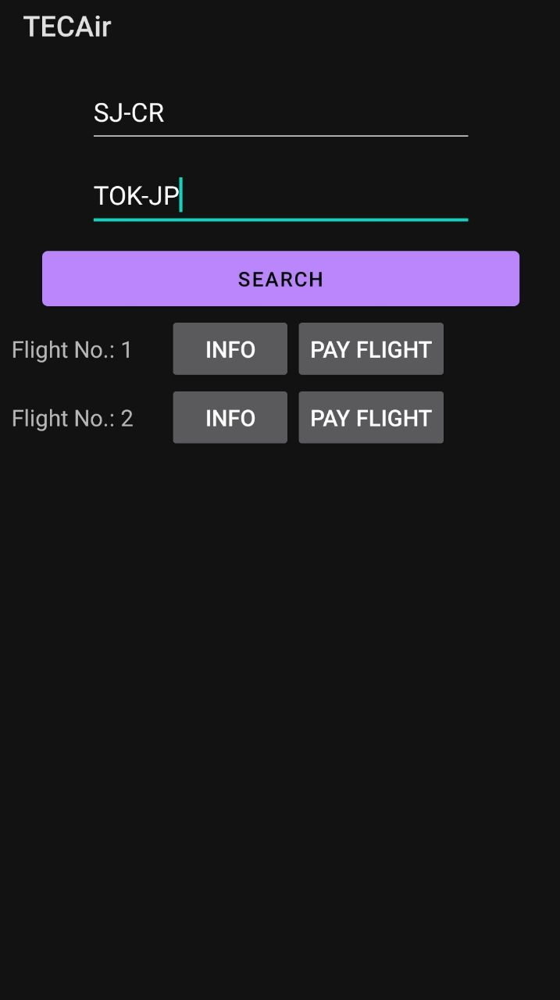
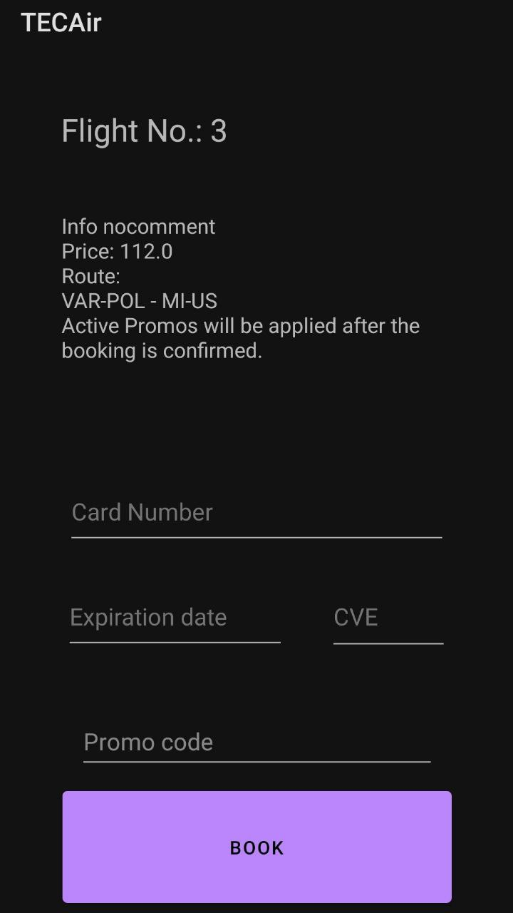

---
title:
  Instituto Tecnológico de Costa Rica\endgraf\bigskip \endgraf\bigskip\bigskip\
  TecAir Manual de Usuario \endgraf\bigskip\bigskip\bigskip\bigskip
author:
  - José Morales Vargas, carné 2019024270
  - Alejandro Soto Chacón, carné 2019008164
  - Ignacio Vargas Campos, carné 2019053776
  - José Retana Corrales, carné 2020144743
date: \bigskip\bigskip\bigskip\bigskip Área Académica de\endgraf Ingeniería en Computadores \endgraf\bigskip\bigskip\ Bases de Datos \endgraf  (CE3101) \endgraf\bigskip\bigskip Profesor Marco Rivera Meneses \endgraf\vfill  Semestre I 2022
header-includes:
  - \setlength\parindent{24pt}
  - \usepackage{url}
  - \usepackage{float}
  - \floatplacement{figure}{H}
lang: es-ES
papersize: letter
classoption: fleqn
geometry: margin=1in
fontsize: 12pt
fontfamily: sans
linestretch: 1.5
...

\maketitle
\thispagestyle{empty}
\clearpage
\tableofcontents
\pagenumbering{roman}
\clearpage
\pagenumbering{arabic}
\setcounter{page}{1}

# Servidor

La interacción con el servidor se da por medio de consultas http a la dirección ip del servidor en el puerto 5000. A continuación se describe como llevar a cabo las operaciones solicitadas en la especificación. Puede probar cada una de las operaciones en la aplicación de swagger.

# App Web

## Gestión de usuario

En la página principal se puede observar el área para el inicio de sesión o "Log In" al sistema. En este aparece 

## Búsqueda de vuelos

## Reservación de vuelos

## Despliegue de promociones

## Gestión de promociones

## Chequeo de pasajeros

## Asignación de maletas a un pasajero chequeado

## Gestión de vuelos

## Apertura de vuelos

## Cierre de vuelos

# App Móvil

## Autenticación

Al abrir la aplicación se presenta una pantalla en la que se ingresan los datos de autenticación, se selecciona el modo de operación (Online u Offline) y se puede realizar algunas configuraciones adicionales:

- Uso con conexión: Cada solicitud se coordinará con el la aplicación que administra el servidor. En cada operación la base de datos actualizará el "caché" de datos local que se utilizará en modo offline.

- Uso sin conexión: Cada solicitud en este modo quedará pendiente de sincronización, y será aplicada hasta un nuevo login en modo en línea o una sincronización sin login. 

- Configuración de servidor: En caso de querer editar la dirección web en la que se espera se encuentre el servidor que provee los datos para la aplicación, puede darle click al botón de configuración de servidor y esto habilitará la caja de texto para ingresar la nueva dirección.

- Sincronización sin conexión: Algunas operaciones puede ser conflictivas si se realizan mientras se tiene una sesión activa, por lo cuál se habilita la posibilidad de sincronizar los datos sin necesidad de loggearse en la aplicación.

Una vez autenticado el usuario, se mostrará el menú principal:

## Gestión de usuario

### Agregar usuario: 

Se hace click en la opción de registrar usuario en el menú principal. Esto abrirá un formulario que permite ingresar los datos para el nuevo usuario. En caso de que el usuario sea un estudiante, presiones el switch, lo que habilitará los campos de nombre de universidad y id de estudiante - lo que también los torna obligatorios.

### Otras operaciones de gestión 

Las operaciones de solicitar información, edición y eliminación se ofrecen en la opción de administración de usuario del menú principal. Esta opción abrirá una lista de usuarios con botones para realizar estas distintas operaciones. Debe tomar en cuenta que edición y eliminación solo se permite para el usuario actual

Al presionar en editar usuario se abrirá un formulario similar al de registro en donde se puede editar toda característica del usuario. 

## Despliegue de promociones

Al presionar en el botón de promociones del menú principal, se listaran las distintas promociones disponibles junto con su código de oferta. En el botón de información de cada promoción podrá consultar más datos sobre la misma.

## Búsqueda de vuelos

Para buscar un vuelo que cruze entre dos aeropuertos durante su ruta, seleccione un aeropuerto como el aeropuerto de origen y otro como el de destino. Al presionar el votón de búsqueda se filtraran entre los vuelos disponibles para booking aquellos que tengan una ruta que pase por los puntos dados. Se dará la posibilidad de consultar más información para cada vuelo encontrado, así como un botón para proceder con la reservación.

## Reservación de vuelos

La pantalla de reservación de vuelos presenta la información del vuelo a ser reservado por el usuario actual. Opcionalmente, el usuario puede agrega un código de promociones. Puesto que es una funcionalidad fuera del scope del proyecto, no se provee una validación del pago real con tarjeta, pero sí se proveen los campos para completar la información que correspondería a una compra.

