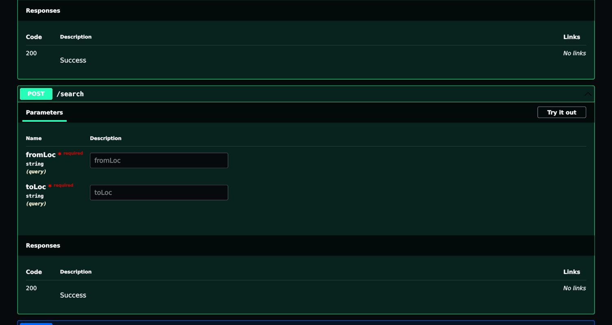
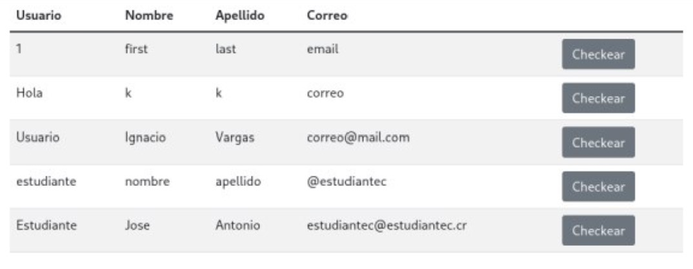

---
title:
  Instituto Tecnológico de Costa Rica\endgraf\bigskip \endgraf\bigskip\bigskip\
  TecAir Manual de Usuario \endgraf\bigskip\bigskip\bigskip\bigskip
author:
  - José Morales Vargas, carné 2019024270
  - Alejandro Soto Chacón, carné 2019008164
  - Ignacio Vargas Campos, carné 2019053776
  - José Retana Corrales, carné 2020144743
date: \bigskip\bigskip\bigskip\bigskip Área Académica de\endgraf Ingeniería en Computadores \endgraf\bigskip\bigskip\ Bases de Datos \endgraf  (CE3101) \endgraf\bigskip\bigskip Profesor Marco Rivera Meneses \endgraf\vfill  Semestre I 2022
header-includes:
  - \setlength\parindent{24pt}
  - \usepackage{url}
  - \usepackage{float}
  - \floatplacement{figure}{H}
lang: es-ES
papersize: letter
classoption: fleqn
geometry: margin=1in
fontsize: 12pt
fontfamily: sans
linestretch: 1.5
...

\maketitle
\thispagestyle{empty}
\clearpage
\tableofcontents
\pagenumbering{roman}
\clearpage
\pagenumbering{arabic}
\setcounter{page}{1}

# Servidor

La interacción con el servidor se da por medio de consultas http a la dirección ip del servidor en el puerto 5000. A continuación se describe como llevar a cabo las operaciones solicitadas en la especificación. Puede probar cada una de las operaciones en la aplicación de swagger.

# App Web

## Gestión de usuario

En la página principal se puede observar el área dedicado para el inicio de sesión o "Log In" al sistema. En este aparecen los espacios disponibles para ingresar el nombre de usuario y la contraseña, así como el botón para enviar esta información a la base de datos para que sea verificada y aceptada/denegada.

Por debajo del área de inicio de sesión, se tiene disponible la opción para it a la página de registro al sistema, el cual se puede ingresar haciendo click en el link azul que dice "Regístrese aquí". Una vez ingresado, se muestran los espacios para ingresar a la base de datos el nombre de usuario que se usará, los nombres y apellidos del usuario, su correo, su número de teléfono, y por último su contraseña.
También se tiene la opción para registrarse como estudiante, el cual se puede activar haciendo click en el checkbox que dice estudiante, el cuál abrirá espacios adicionales para ingresar el nombre de la universidad y el id estudiantil. Una vez ingresado por lo menos los valores requeridos, se debe apretar el botón azul que dice "Regístrese", para terminar el proceso.

Una vez ingresado en el sistema por medio de la página principal de Log In, se muestra en la parte superior los tabs de la barra de navegación ya disponibles según el acceso que tiene la cuenta. Si no se tiene acceso de trabajador, solo se le va a mostrar la página de promociones y de búsqueda de vuelos. Si se tiene acceso especial de trabajadores en la cuenta, se mostrará aparte de lo anterior el acceso a las páginas de gestión de promociones, de chequeo de pasajeros, de asignación de maletas a un pasajero chequeado, de gestión de vuelos, de apertura de vuelos y de cierre de vuelos.

Si se está ingresado a un cuenta con acceso especial de trabajadores, se puede ingresar al tab de Gestión de Usuario, donde se presenta la lista de todos los usuarios registrados, donde también se pueden modificar y eliminar a estos.

Igualmente, se puede accesar al tab de Gestión de funcionarios, donde se puede apreciar como se pueden editar, registrar y eliminar cuentas para trabajadores.

## Búsqueda de vuelos

En esta página se puede ingresar en los espacios indicados los códigos de aeropuerto de origen y de llegada del viaje que se desea reservar. Una vez ingresados unos códigos validos de aeropuertos, se puede apretar el botón de "buscar" azul, el cual hará que se popule la tabla inferior con todos los vuelos disponibles y su respectiva información (ID de Vuelo, Número de Vuelo, Precio, Ruta Completa, Comentarios) según los aeropuertos ingresados que pasen por esos dos aeropuertos.

Para cada viaje disponible, se muestra un botón azul que dice "Reservar" para irse a la página de reservaciones de dicho viaje.

## Reservación de vuelos

Una vez seleccionada el vuelo en la búsqueda de vuelos, se le mostrará la página de booking/reservación de vuelos, donde aparecerá de nuevo toda la información del vuelo seleccionado, así como los espacios para ingresar el número de tarjeta de crédito o débito, la fecha de expiración y código CVE de este, así como la opción de ingresar un código de promoción válido. Una vez ingresados los valores indicados, se realizará la reservación para el usuario de la cuenta de ese viaje indicado.

## Despliegue de promociones

En la página de despliegue de promociones se muestra el carrusel con todas las promociones disponibles en el momento, donde se incluye en cada rótulo el código que se deberá ingresar en la página de reservación de vuelos en el respectivo viaje indicado.

## Chequeo de pasajeros

Con una cuenta de trabajador, se puede accesar al tab de Chequeo de Pasageros, donde se mostrará inicialmente la lista de vuelos y sus paradas, junto con la posibilidad de seleccionar cuál de los segmentos del vuelo se desea hacer el proceso de chequeo de los pasajeros. Debajo de este, se encuentra también un botón "Chequear" para proceder con este proceso en el segmento indicado.

Una vez ingresado se mostrará la lista de usuarios con reservaciones al vuelo, así como su información y un botón de "Chequear" para realizar el chequeo de cada uno individualmente.

Una vez seleccionado un usuario, se muestra en pantalla visualmente cada asiento del avión, para así dejar al usuario seleccionar en cuál asiento se quiere chequear. Una vez seleccionado es asiento, se debe apretar el botón "Book Now" para terminar con el proceso de chequeo con el usuario respectivo.

## Asignación de maletas a un pasajero chequeado

## Gestión de vuelos

Al ingresar al tab de gestión de vuelo con una cuenta autorizada, se mostrará a la izquierda un form que permitirá registrar un nuevo vuelo, donde se le pregunta número, precio, comentario, el aeropuerto de origen junto con el avión a utilizar y las horas de llegada y partida. EN la sección más baja del forms, se muestra la opción para registrar al avión un nuevo destino, el se realiza escogiendo el aeropuerto de escogencia y dándole click al botón "+". Después de hacer esto se le permitirá modificar lo mismo que lo que se determinó para el aeropuerto de origen. También se le permite quitar destinos si se agregán más de los que se necesitan, lo cuyal se realiza apretando el botón rojo con un "-". En el lado derecho se mostrarán una lista con información resumida de los vuelos registrados en ese momento.

## Apertura de vuelos
En esta pantalla para administradores se es posible ver la lista de vuelos en este momento sin abrir, cada uno con un botón que permite abrirlos.

## Cierre de vuelos
En esta pantalla para administradores se es posible ver la lista de vuelos en este momento que se pueden cerrar, cada uno con un botón que permite cerrarlos a voluntad.

Al apretar alguno de los botones de los aviones, se pasa a la pantalla del reporte del cierre, donde aparecen la lista con los pasajeros y la cantidad de maletas que llevaban, así como la opción para confirmar la clausura del vuelo.

# App Móvil

## Autenticación

Al abrir la aplicación se presenta una pantalla en la que se ingresan los datos de autenticación, se selecciona el modo de operación (Online u Offline) y se puede realizar algunas configuraciones adicionales:

- Uso con conexión: Cada solicitud se coordinará con el la aplicación que administra el servidor. En cada operación la base de datos actualizará el "caché" de datos local que se utilizará en modo offline.

- Uso sin conexión: Cada solicitud en este modo quedará pendiente de sincronización, y será aplicada hasta un nuevo login en modo en línea o una sincronización sin login.

- Configuración de servidor: En caso de querer editar la dirección web en la que se espera se encuentre el servidor que provee los datos para la aplicación, puede darle click al botón de configuración de servidor y esto habilitará la caja de texto para ingresar la nueva dirección.

- Sincronización sin conexión: Algunas operaciones puede ser conflictivas si se realizan mientras se tiene una sesión activa, por lo cuál se habilita la posibilidad de sincronizar los datos sin necesidad de loggearse en la aplicación.

Una vez autenticado el usuario, se mostrará el menú principal:

## Gestión de usuario

### Agregar usuario:

Se hace click en la opción de registrar usuario en el menú principal. Esto abrirá un formulario que permite ingresar los datos para el nuevo usuario. En caso de que el usuario sea un estudiante, presiones el switch, lo que habilitará los campos de nombre de universidad y id de estudiante - lo que también los torna obligatorios.

### Otras operaciones de gestión

Las operaciones de solicitar información, edición y eliminación se ofrecen en la opción de administración de usuario del menú principal. Esta opción abrirá una lista de usuarios con botones para realizar estas distintas operaciones. Debe tomar en cuenta que edición y eliminación solo se permite para el usuario actual

Al presionar en editar usuario se abrirá un formulario similar al de registro en donde se puede editar toda característica del usuario.

## Despliegue de promociones

Al presionar en el botón de promociones del menú principal, se listaran las distintas promociones disponibles junto con su código de oferta. En el botón de información de cada promoción podrá consultar más datos sobre la misma.

## Búsqueda de vuelos

Para buscar un vuelo que cruze entre dos aeropuertos durante su ruta, seleccione un aeropuerto como el aeropuerto de origen y otro como el de destino. Al presionar el votón de búsqueda se filtraran entre los vuelos disponibles para booking aquellos que tengan una ruta que pase por los puntos dados. Se dará la posibilidad de consultar más información para cada vuelo encontrado, así como un botón para proceder con la reservación.

## Reservación de vuelos

La pantalla de reservación de vuelos presenta la información del vuelo a ser reservado por el usuario actual. Opcionalmente, el usuario puede agrega un código de promociones. Puesto que es una funcionalidad fuera del scope del proyecto, no se provee una validación del pago real con tarjeta, pero sí se proveen los campos para completar la información que correspondería a una compra.

