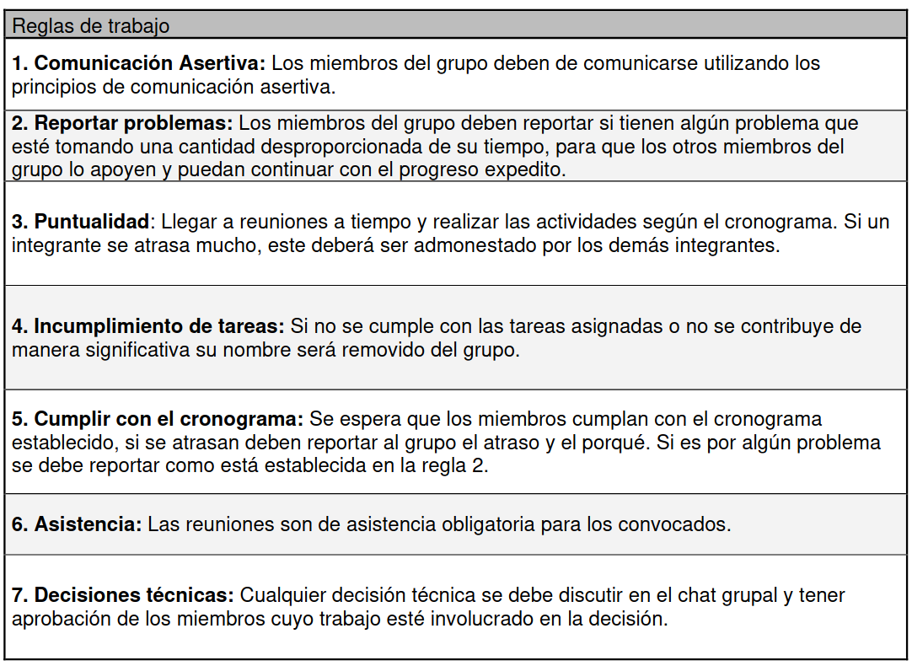
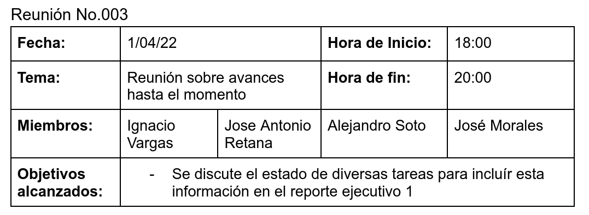

---
title:
  Instituto Tecnológico de Costa Rica\endgraf\bigskip \endgraf\bigskip\bigskip\
  TecAir Plan de Proyecto \endgraf\bigskip\bigskip\bigskip\bigskip
author:
  - José Morales Vargas, carné 2019024270
  - Alejandro Soto Chacón, carné 2019008164
  - Ignacio Vargas Campos, carné 2019053776
  - José Retana Corrales, carné 2020144743
date: \bigskip\bigskip\bigskip\bigskip Área Académica de\endgraf Ingeniería en Computadores \endgraf\bigskip\bigskip\ Bases de Datos \endgraf  (CE3101) \endgraf\bigskip\bigskip Profesor Marco Rivera Meneses \endgraf\vfill  Semestre I 2022
header-includes:
  - \setlength\parindent{24pt}
  - \usepackage{url}
  - \usepackage{float}
  - \floatplacement{figure}{H}
lang: es-ES
papersize: letter
classoption: fleqn
geometry: margin=1in
fontsize: 12pt
fontfamily: sans
linestretch: 1.5
bibliography: bibliografia.bib
csl: /home/josfemova/UsefulRepos/styles/ieee.csl
nocite: |
...

\maketitle
\thispagestyle{empty}
\clearpage
\tableofcontents
\pagenumbering{roman}
\clearpage
\pagenumbering{arabic}
\setcounter{page}{1}

# Plan de Proyecto

## Metas de proyecto 

### 1. Desarrollo de la Base de Datos en PostgreSQL 

Alejandro Soto desarrollará la Base de Datos en PostgreSQL definiendo el modelo de la base de datos, haciendo la investigación necesaria sobre PostgresSQL y creando el script de creación y populación de la base de datos.

- **Criterio de entrega:** Base de Datos 100% funcional según las especificaciones determinadas.

- **Fecha estimada de entrega:** Abr 05, 2022

### 2. Desarrollo del servicio API 

Alejandro Soto desarrollará el servicio API, haciendo la investigación necesaria sobre el Entity Framework e implementando el REST API.

- **Criterio de entrega:** Servicio del REST API 100% funcional según las especificaciones determinadas.

- **Fecha estimada de entrega:** Abr 09, 2022

### 3. Crear app web para clientes (Vista Reservaciones): 

Jose Retana e Ignacio Vargas desarrollarán la vista de reservaciones de la app web cliente.

- **Criterio de entrega:** Desarrollo 100% completado de la app web cliente según las especificaciones determinadas (Gestión de Usuario, Búsqueda de Vuelos, Reservación de vuelos).

- **Fecha estimada de entrega:** Abr 05, 2022

### 4. Crear app web para funcionarios (Vista Aeropuerto): 

Jose Retana e Ignacio Vargas desarrollarán la vista aeropuerto interna de la app web, tal que tenga la misma funcionalidad que la vista reservaciones, pero con las demás funciones determinadas en la especificación.

- **Criterio de entrega:** Desarrollo 100% completado de la app web para funcionarios según las especificaciones determinadas (Funcionalidades cliente, Promociones, Chequeo de pasajeros, Asignación de maletas a un pasajero chequeado, Gestión de vuelos, Apertura de vuelos, Cierre de vuelos).

- **Fecha estimada de entrega:** Abr 13, 2022

### 5. Crear app móvil para clientes (Vista Aeropuerto Móvil): 

José Morales desarrollará la app móvil, la cual tendrá la misma funcionalidad que la app web para cliente. Se realizará la investigación de SQL Lite para su implementación en una base de datos empotrada, la cuál se sincronizará con la principal por medio del servicio API.

- **Criterio de entrega:** Desarrollo 100% completado de la app móvil y su conexión/sincronización con la base de datos principal.

- **Fecha estimada de entrega:** Abr 15, 2022

## Roles y Reglas

## Cronograma

## Minutas de trabajo

## Bitácoras

### José  Morales

- 21 MAR
    
    + Participé en la reunión de grupo para definir plan de trabajo y otros aspectos de trabajo individual y en equipo
    + Se divieron los roles de trabajo
    + Se crean repositorios y otros archivos de trabajo colaborativo

- 25 MAR

    + Colaboré con la creación y revisión del documento entregable que contenía el plan de trabajo inicial
    + El equipo se reunió para tomar ciertas decisiones sobre aspectos operativos de grupo pues varios presentan dificultades con fechas de entrega estimada debido a exámenes de cursos exigentes en las fechas cercanas

- 1 ABR

    + Se realiza una reunión para discutir los avances hasta el momento de forma que se puedan incluír en el reporte ejecutivo 1.

- 4 ABR
    
    + Debido a la cercanía con una evaluación fuerte que varios miembros del equipo teníamos, se decide mover un poco las fechas planteadas en el plan de trabajo original

- 6 ABR

    + Investigué sobre desarrollo de aplicaciones de android con Kotlin, pues parece ser la opción sugerida para aplicaciones nuevas.
    + También empecé una investigación inicial sobre `Room`, una API relativamente nueva la cual es oficialmente recomendada para interacciones con SQLite

- 7 ABR
    
    + Se investiga sobre el uso de la biblioteca `Retrofit2` para el consumo de servicios REST.
    + Se realiza un diseño inicial de la arquitectura de la aplicación móvil a implementar.
    + Se realiza una reunión para discutir los avances hasta el momento de forma que se puedan incluír en el reporte ejecutivo 2.

- 8 ABR

    + Se crea el proyecto inicial de la app móvil.
    + Se agregan las activity base al proyecto y programé parcilamente su funcionalidad.

- 9 ABR
    
    + Se implementa una primera base de datos en room para comprobar funcionalidad, sin embargo solo está una estructura inicial, no esta en uso aún, es más como una prueba de concepto.

- 11 ABR

    + Agregué mi trabajo hasta este punto al repositorio compartido.

- 12 ABR
    
    + Se agregan clases relacionadas al funcionamiento interno de la app móvil tal como las clases para representar los tipos de sesiones (en línea o desconectado).
    + Se especifican algunos de los endpoints que la app móvil espera estén en la aplicación REST.
    + Se inicia trabajo en completar la actividad utilizada para registrar nuevos usuarios.
    + Se implementa una versión inicial de funcionalidad de login en modo offline, lo que también implica la prueba de uso de la funcionalidad de base de datos local implementado con `Room`.

- 13 ABR

    + Se agrega lógica para listar entidades en distintas vistas (Activities, no vistas de base de datos).
    + Se agrega lógica para registrar nuevos usuarios en base de datos local.
    + Se agregan uuids como llave primaria para todas las entidades para conservar coherencia.
    + Se agrega funcionalidad para las vistas de promociones y búsqueda de vuelos, pero están sujetos a cambio.
    + Se agregan algunos DAO de `Room` para manipulación de datos de las base de datos local en SQLite.

- 14 ABR

    + Se realizan modificaciones a la base de datos local para que sea coherente con el diseño final de la base de datos en el servidor y se agregan algunas entidades faltantes para la base de datos que se usa como caché.
    + Se diseña una segunda base de datos en room específicamente para almacenar las operaciones que deberán ser sincronizadas una vez se inicie una sesión en línea.
    + Se implementa funcionalidad de edición de usuarios para sesiones sin conexión al servidor.
    + Se implementa funcionalidad de eliminar usuarios para sesiones sin conexión al servidor.
    + Se implementa funcionalidad de búsqueda de vuelos para sesiones sin conexión al servidor.
    + Se implementa funcionalidad de reservaciones para sesiones sin conexión al servidor.
    + Se implementa funcionalidad de listado de promociones para sesiones sin conexión al servidor.

- 15 ABR

    + Se agregan las requests faltantes a la interfaz de retrofit2 para comunicarse con el servidor
    + Se implementa funcionalidad de edición de usuarios para sesiones sin conexión al servidor.
    + Se implementa método de sincronización con base de datos del servidor.
    + Se replican las funcionalidades ya implementadas para sesiones sin conexión para las sesiones online. 

- 23 ABR
    + Se agrega documentación interna a la aplicación móvil.
    + Se redacta el manual de instalación para las diferentes aplicaciones desarrolladas en grupo.
    + Se realizan pruebas de integración con la aplicación REST

- 24 ABR

    + Se realizan pruebas de funcionamiento de sistema.
    + Se completa documentación faltante.
    + Se agregan correciones a App Web basados en resultados de pruebas de todo el sistema en conjunto.
    + Se realiza la entrega final del proyecto.

### José Retana

- 21 Marzo: Se atiende a la reunión inicial para la definición de las actividad a realizar, los roles, reglas y demás

- 25 Marzo: Se realiza una reeunión de trabajo para discutir mover las entregas del grupo de trabajo, ya que se presentó una evaluación importante a ciertos integrantes, que les complicaba realizar normalmente el trabajo designado. 

- 01 Abril: Se crea una reunión para generar el reporte ejecutivo 1, y así discutir lo que se ha realizado por cada estudiante hasta el momento.

-6  Abril: A partir de los inicios del app web planteados por Ignacio, se empieza a montar un mockup de la página de búsqueda de los viajes disponibles. En este se muestran los espacios para escribir los códigos ed los aeropuertos y la tabla vacía con nombres de filas según lo estipulado por Alejandro Soto en el modelo relacional.

-7  Abril: Se crea una reunión para generar el reporte ejecutivo 2, y así discutir lo que se ha realizado por cada estudiante hasta el momento.

-10 Abril: Se crea un mockup no funcional de la reservaciones de vuelos, donde se incluyen los espacios para tarjeta, código de promoción y demás.

-17 Abril: Una vez implementados los endpoints de Alejandro Soto, se Implementa la funcionalidad a la página de búsqueda de vuelos.

-19 Abril: Se hace la funcionalidad de la página de reservaciones de vuelos o de "booking". No se implementa la parte de promociones, ya que falta este endpoint.

-23 Abril: Se implementan las promociones en la página de booking/reservaciones de vuelos.

-24 abril: Se ayuda a terminal el trabajo escrito, los manuales de ususario y las pruebas de funcionalidad. Se realiza una reunión general para realizar las pruebas finales de funcionalidad y lo que falta de documentación de errores y problemas incompletos, para así poder realizar la entrega final.
### Ignacio Vargas

- 21/03: Se hace una primera reunión general para discutir las especificaciones del proyecto, y así de una empezar con las partes y labores más administrativas, como la repartición de roles, actividades, reglas, etc.

- 25/03: Se hace una reunión debido a que tengo un examen muy dificil y complicado que va a consumir una gran parte de mi tiempo, por lo que no se va a poder llevar a cabo a tiempo varias de las actividades planeadas.

- 01/04: Se hace la reunión para crear el reporte ejecutivo 1. Se indica las cosas en las que se atrasó el desarrollo del proecto y en lo que se pudo trabajar.

- 05/04: Se crea las bases iniciales y el setup de angular y bootstrap y se empizan a crear templates iniciales para el navbar, servicios, interfaces, etc.

- 06/04: Se empieza un prototipo del login y del registro de usuarios, con sus respectivos campos y botones no funcionales.

- 07/04: Se asiste a la reunión del reporte ejecutivo 2. Al igual que el primero, se indica en lo que se atrasó y en lo que se pudo trabajar.

- 12/04: Se crean los prototipos del chequeo y se investiga como mostrar los asientos a la hora de hacer este proceso. Se termina utilizando css para crear los "asientos", pero se tiene que seguir trabajadno en eso.

- 19/04: Con los endpoints iniciales de Alejandro, se puede ya implementar todo el login, registro y los inicios del registro de usuarios y trabajadores.

- 20/04: Se completa todo lo relacionado con el registro de usuarios. Se empiza a terminar e implementar el chequeo de usuarios, para que se muestre correctamente los vuelos con la cantidad de segmentos de vuelo correspondiente y adecuado, los usuario que se puede chequear y demás.

- 22/04: Se empieza y termina la gestión de apertura y cierre de vuelos.

- 23/04: Se empieza y termina la gestión de vuelos, así copmo se inicia la asignación de maletas.

- 24/04: Se termina la asignación de maletas. Se hace una reunión para ya terminar la parte escrita y poder revisar bien los casos que tenemos listos y funcionales.

### Alejandro Soto

- 21 de marzo: Se definen actividades iniciales y el plan de trabajo.  Se crea el repositorio de trabajo.

- 25 Marzo: Se agenda y realiza una reunión para verificar si es posible trasladar las fechas de lo entregable de cada integrante, ya que algunos de estos tiene ciertos trabajos y exámenes que requieren de tiempo extra, por lo que se va a atrasar ciertas entregas.

- 01 de Abril: Se define que se va a realizar una reunión para generar el reporte ejecutivo #1, donde se analizaron los diversos aspectos de trabajo que ya fueron realizados, las actividades que se atrasaron y demás.

- 4 de abril: Montado inicial del backend. Decido utilizar parte del trabajo previo realizado en la Tarea Corta #1.  El backend está escrito en C#. Hoy solamente se inicializa el proyecto y se discute informalmente el desarrollo futuro.

- 6 de abril: A partir de la especificación del proyecto se determinan los modelos conceptual y relacional a utilizar.

-7  Abril: Se crea la segunda reunión para los resumenes ejecutivos de cada semana, donde, igualmente que en la primera, se identifica las tareas que ya se han cumplido y cuales se han atrasado según la agenda de trabajo.

- 9 de abril: Intenté instalar EntityFramework Core en mi entorno de trabajo sin mayor éxito debido a problemas de dependencias. Documenté en bitácora actividades realizadas hasta ahora.

- 16 de abril: Creo endpoints para checkin y booking. Parecen funcionar bien según Swagger. También arreglé un bug en el endpoint de editar usuario debido a lazy evaluation que introduje hace poco debido a una limitación de EF.

- 22 de abril: Termino el último endpoint que me solicitan los compañeros de trabajo (para operaciones CRUD sobre promociones).

- 24 de abril: Se documenta el backend. Se revisa que no existan más problemas de integración. Se realiza una última reunión para verificar y coxnsolidar lo que se tiene y lo que se falta para la entrega final, así también para finalizar los detalles del trabajo escrito que faltan.
